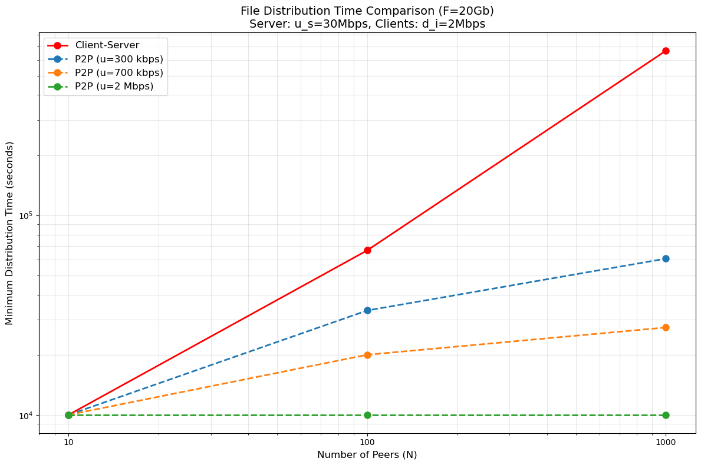

# 计算机网络第二次作业

---

## 第一题 P3

​	除了 HTTP 外，还需要传输层的 TCP 协议和应用层的 DNS 协议。其中，DNS 协议用于将域名解析为 IP 地址，TCP 协议用于给 HTTP 提供可靠的数据传输。

---

## 第二题 P4

### a. 由浏览器请求的文档的 URL 是什么？

​	依据第一行 `GET /cs453/index.html` 表示请求的路径是 `/cs453/index.html`，`Host: gaia.cs.umass.edu` 表示该服务器的主机名。因此完整的URL为http://gaia.cs.umass.edu/cs453/index.html。

### b. 该浏览器运行的是 HTTP 的何种版本？

​	第一行 `GET /cs453/index.html HTTP/1.1` 表明运行的是 $1.1$ 版本的 HTTP。

### c. 该浏览器请求的是一条非持续连接还是一条持续连接？

​	最后一行 `Connection: keep-alive` 表示浏览器请求的是一条持续连接。

### d. 该浏览器所运行的主机的 IP 地址是什么？

​	这条报文里好像没有找到相关信息。

### e. 发起该报文的浏览器的类型是什么？在 HTTP 请求报文中，为什么需要浏览器类型？

​	依据 `User-Agent: Mozilla/5.0 (Windows; U; Windows NT 5.1; en-US; rv:1.7.2) Gecko/20040804 Netscape/7.2 (ax)` 表明该浏览器类型是 `Netscape 7.2` 。需要浏览器类型的原因是服务器需要根据不同的浏览器类型来返回特定版本的 HTML/CSS/JS 以兼容旧版本的浏览器、给手机浏览器显示手机版的页面以及屏蔽某些特定的浏览器或爬虫。

---

## 第三题 P7

​	访问 $n$ 个 DNS 服务器，说明是迭代查询，DNS 查询时间为：
$$
T_{DNS} = \sum_{i=1}^{n}RTT_i
$$
​	在建立 TCP 连接时，前两次握手需要一个 $RTT_0$, 最后一次握手附带发送请求报文，最终得到响应需要一个 $RTT_0$，因此总时间为：
$$
T_{total} = 2\cdot RTT_0 +\sum_{i=1}^{n}RTT_i
$$

---

### 第四题 P22

### 1. Client-Server

$$
T_{c-s} \geq max\{\frac{NF}{u_s}, \frac{F}{d_{min}}\}
$$

对于 $N = 10$，$N=100$，$N=1000$ 的情况，分别代入数据，可算得下列最小分发时间：
| N    | $T_{\text{min}}^{\text{C-S}}$ (s) |
| ---- | --------------------------------- |
| 10   | 10,000                            |
| 100  | 66,666.67                         |
| 1000 | 666,666.67                        |

### 2. P2P

$$
T_{P2P} \geq \max \left\{ \frac{F}{u_s}, \frac{F}{d_{\min}}, \frac{NF}{(u_s + \sum u_i)} \right\}
$$

在本题中，每个peer的上传速率 $u_i$ 都相同，因此上式可写成：
$$
T_{P2P} \geq \max \left\{ \frac{F}{u_s}, \frac{F}{d_{i}}, \frac{NF}{u_s + N \times u} \right\}
$$


对于每个 N 和 u 的组合，分别代入数据，可算得下列最小分发时间：

| N    | \( u = 300 \) kbps | \( u = 700 \) kbps | \( u = 2 \) Mbps |
| ---- | ------------------ | ------------------ | ---------------- |
| 10   | 10,000             | 10,000             | 10,000           |
| 100  | 33,333.33          | 20,000             | 10,000           |
| 1000 | 60,606.06          | 27,397.26          | 10,000           |

使用下面的python程序生成图表：
```py
import matplotlib.pyplot as plt

# 参数设置
F = 20 * 1000  # 20 Gb = 20,000 Mb
u_s = 30  # Mbps
d_i = 2  # Mbps
N_values = [10, 100, 1000]  # 对等方数量
u_values = [0.3, 0.7, 2]  # 对等方上传速率 (Mbps)

# 计算客户-服务器模式时间
def cs_time(N):
    return max(N * F / u_s, F / d_i)

cs_times = [cs_time(N) for N in N_values]

# 计算P2P模式时间
def p2p_time(N, u):
    return max(F / u_s, F / d_i, (N * F) / (u_s + N * u))

p2p_times = {
    '300 kbps': [p2p_time(N, 0.3) for N in N_values],
    '700 kbps': [p2p_time(N, 0.7) for N in N_values],
    '2 Mbps': [p2p_time(N, 2) for N in N_values]
}

# 绘制图表
plt.figure(figsize=(12, 8))

# 客户-服务器模式
plt.plot(N_values, cs_times, 'ro-', label='Client-Server', linewidth=2, markersize=8)

# P2P模式
for u_label, times in p2p_times.items():
    plt.plot(N_values, times, 'o--', label=f'P2P (u={u_label})', linewidth=2, markersize=8)

# 图表美化
plt.xscale('log')
plt.yscale('log')
plt.xticks(N_values, labels=[str(n) for n in N_values])
plt.xlabel('Number of Peers (N)', fontsize=12)
plt.ylabel('Minimum Distribution Time (seconds)', fontsize=12)
plt.title('File Distribution Time Comparison (F=20Gb)\n'
          f'Server: u_s={u_s}Mbps, Clients: d_i={d_i}Mbps', fontsize=14)
plt.grid(True, which="both", ls="-", alpha=0.3)
plt.legend(fontsize=12)
plt.tight_layout()

# 显示图表
plt.show()
```

结果如下：


## 第五题 P27

a. 如果生成音频和视频的混合文件，由乘法原理，总共需要存储 $N^2$ 个文件。

b. 如果分别发送音频流和视频流，由加法原理，总共需要存储 $2\times N$ 个文件。