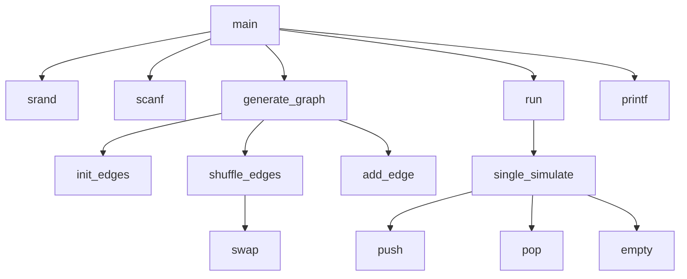

# 题目：随机有向图可达性分析

---

### 1. 需求分析 

**任务描述**：  
从命令行接受整数V和E，随机生成含有V个顶点和E条边的简单有向图，即不包含自环和平行边，存储结构无限定。对此有向图，运行实验求从一个随机选定的顶点可以到达的顶点数量的平均值。

**输入/输出要求**：  

- **输入形式**：由空格分隔的两个整数 $V$和 $E$，表示顶点数和边数。
- **输出形式**：一个两位小数，表示随机取一个顶点可达的顶点数量平均值。
- **限制**：$1 \leq V \leq 1000$，$1 \leq E \leq V(V-1)$。

**功能要求**：  

1. 随机生成一个顶点数为V，边数为E的图。
2. 求出从一个随机选定的顶点可以到达的顶点数量的平均值。

---

### 2. 概要设计  

**解决思路**：  

1.  **预处理**：生成一个包含所有 $V \times (V-1)$ 条可能的有向边的列表。
2.  **随机选边**：使用 Fisher-Yates 洗牌算法将该列表打乱，并选取前 $E$ 条边作为图的边集。
3.  **构建图**：根据选出的 $E$ 条边，使用邻接表数据结构构建有向图。
4.  **蒙特卡洛模拟**：
    1.  重复进行 1000 次实验。
    2.  在每次实验中，随机选取一个顶点作为起点。
    3.  使用广度优先搜索 (BFS) 算法，从该起点出发，遍历所有可达的顶点并计数。
5.  **计算平均值**：将 1000 次实验得到的可达顶点数累加，并除以 1000，得到最终的平均值。

**数据结构**：  

1.  **图的存储**：采用邻接表。每个顶点有一个链表，存储从该顶点出发的所有边。
    ```c
    typedef struct Anode {
        int to;
        struct Anode* nextarc;
    } ArcNode;
    
    typedef struct Vnode {
        ArcNode *firstarc;
    } AdjList[MAXV];
    
    typedef struct {
        AdjList adjlist;
        int n, e;
    } Agraph;
    ```

2.  **BFS 辅助队列**：使用一个简单的数组和两个指针 `front`, `tail` 来模拟队列，用于广度优先搜索。`visited` 数组用于标记节点是否已被访问。
    ```c
    int queue[MAXV<<1], front, tail;
    bool visited[MAXV];
    ```

**模块关系**：  

-   **图生成模块**：
    -   `generate_graph`：核心函数，协调图的生成过程。
    -   `init_edges`：初始化包含所有可能边的全局数组。
    -   `shuffle_edges`：随机打乱并选取 E 条边。
    -   `add_edge`：向邻接表中添加一条具体的边。
-   **模拟与计算模块**：
    -   `run`：负责执行指定次数的模拟实验并计算平均值。
    -   `single_simulate`：执行单次模拟，包括随机选点和调用 BFS。
-   **BFS 核心模块**：
    -   `push`, `pop`, `empty`：提供基本的队列操作，支持广度优先搜索。
-   **主程序模块**：
    -   `main`：程序入口，负责解析输入、调用图生成和模拟计算模块，并最终输出结果。

---

### 3. 详细设计  

**关键算法**：  

1.  **`void generate_graph(int V, int E)`**
    -   **作用**：根据给定的顶点数 `V` 和边数 `E`，构建一个随机有向图。
    -   **详细步骤**：
        1.  检查 `E` 是否超出最大可能边数 $V \times (V-1)$，若超出则报错退出。
        2.  调用 `init_edges(V)` 生成所有可能的边，并存储到全局数组 `edges` 中。
        3.  调用 `shuffle_edges(E)` 对 `edges` 数组进行随机化处理，并截取前 `E` 条。
        4.  初始化图 `g` 的顶点数 `n`。
        5.  遍历处理后的 `edges` 数组，解码出每条边的起点 `x` 和终点 `y`，并调用 `add_edge(&g, x, y)` 将边添加到邻接表中。

2.  **`void shuffle_edges(int k)`**
    -   **作用**：实现 Fisher-Yates 洗牌算法，用于从 `cnt` 条可能的边中无偏地随机选取 `k` 条。
    -   **实现细节**：
        -   循环 `i` 从 `0` 到 `k-1`：
        -   在 `[i, cnt-1]` 范围内生成一个随机索引 `j`。
        -   交换 `edges[i]` 和 `edges[j]` 的内容。
        -   循环结束后，数组 `edges` 的前 `k` 个元素即为随机选出的边集。
        -   将全局边计数 `cnt` 更新为 `k`。

3.  **`int single_simulate(int n)`**
    -   **作用**：执行一次完整的模拟：随机选择一个起点，并计算从它出发可达的顶点总数。
    -   **详细步骤**：
        1.  **重置状态**：将队列头尾指针 `front` 和 `tail` 置为0，并使用 `memset` 清空 `visited` 数组，确保本次模拟不受上次影响。
        2.  **随机选点**：通过 `rand() % n + 1` 随机选择一个 `1` 到 `n` 之间的顶点作为起点 `x`。
        3.  **BFS 初始化**：将起点 `x` 推入队列 (`push(x)`)，并标记为已访问。
        4.  **BFS 遍历**：
            -   当队列不为空时，出队一个顶点 `u`，可达顶点计数 `res` 加一。
            -   遍历 `u` 的邻接链表，对于每个邻接点 `v`，如果 `v` 未被访问过，则将其入队并标记为已访问。
        5.  **返回结果**：BFS 结束后，`res` 即为从起点 `x` 可达的顶点总数（包括起点自身），函数返回该值。

4.  **`double run(int n, int t)`**
    -   **作用**：执行 `t` 次模拟，并计算可达顶点数的平均值。
    -   **流程**：
        1.  初始化总和 `res = 0`。
        2.  循环 `t` 次，每次调用 `single_simulate(n)` 并将其返回值累加到 `res` 中。
        3.  循环结束后，返回 `(double)res / t` 作为平均值。

5.  **`int main(int argc, char *argv[])`**
    -   **作用**：程序主入口，协调整个流程。
    -   **流程**：
        1.  调用 `srand(time(NULL))` 初始化随机数种子。
        2.  从标准输入读取顶点数 `V` 和边数 `E`。
        3.  调用 `generate_graph(V, E)` 构建图。
        4.  调用 `run(V, 1000)` 执行 1000 次模拟并获取平均值。
        5.  使用 `printf("%.2f\n", ans)` 将结果格式化为两位小数并输出。

**流程图**：  

-   **图生成流程 (`generate_graph`)**
    ```mermaid
    flowchart TD
        A["开始(V, E)"] --> B{"E > V*(V-1)?"};
        B -->|"是"| C["报错并退出"];
        B -->|"否"| D["调用 init_edges(V) 生成所有边"];
        D --> E["调用 shuffle_edges(E) 随机选取E条边"];
        E --> F["循环遍历选中的E条边"];
        F --> G["解码出边的起点x和终点y"];
        G --> H["调用 add_edge(g, x, y)"];
        H --> F;
        F -- "循环结束" --> I["完成"];
    ```

-   **单次模拟流程 (`single_simulate`)**
    ```mermaid
    flowchart TD
        A["开始(n)"] --> B["重置队列和visited数组"];
        B --> C["随机选择起点 x"];
        C --> D["将 x 入队，标记 visited[x]=true"];
        D --> E{"队列是否为空？"};
        E -->|"是"| F["返回可达节点数 res"];
        E -->|"否"| G["u = 出队()"];
        G --> H["res++"];
        H --> I["遍历 u 的邻接点 v"];
        I --> J{"v 是否已访问？"};
        J -->|"是"| I;
        J -->|"否"| K["将 v 入队，标记 visited[v]=true"];
        K --> I;
        I -- "遍历结束" --> E;
    ```

**函数调用关系图**：  



**调用关系说明**：

-   **`main` 函数**是顶层控制器，它按顺序调用了图生成函数 `generate_graph` 和模拟运行函数 `run`。
-   **`generate_graph`** 负责建图的所有步骤，它依赖 `init_edges` 来创建候选边集，`shuffle_edges` 来随机化选取，以及 `add_edge` 来填充邻接表。
-   **`run`** 是模拟的驱动器，它多次调用 `single_simulate` 来收集数据。
-   **`single_simulate`** 是单次实验的核心，它实现了 BFS 算法，并依赖 `push`、`pop`、`empty` 这三个辅助函数来操作队列。

---

### 4. 调试分析  

**问题与解决**：  

1.  - **问题描述**：在早期版本中，BFS 队列的头尾指针 `front` 和 `tail` 是全局变量，且只在程序启动时隐式初始化一次。这导致只有第一次调用 `single_simulate` 是正确的，后续调用会因为 `front` 和 `tail` 的值未重置而出错，甚至导致数组越界。
    
    -   **解决方案**：在 `single_simulate` 函数的入口处，显式地将 `front` 和 `tail` 重置为0，即 `front = tail = 0;`。这样确保了每次模拟都从一个干净的空队列开始。
    
2.  - **问题描述**：程序能够正确计算出平均值，但在 `main` 函数中调用 `run` 函数后，没有接收其返回值，也未进行任何输出。程序运行后无声无息地结束，无法验证结果。
    
    -   **解决方案**：在 `main` 函数中，使用一个 `double` 类型的变量 `ans` 来接收 `run` 函数的返回值，并使用 `printf("%.2f\n", ans);` 将结果打印到控制台。

**改进方向**：  

-   **减少全局变量**：当前代码大量使用全局变量（如 `g`, `edges`, `queue`, `visited` 等），这使得模块间的耦合度较高，容易引发类似队列未重置的错误。未来可以将其重构为通过函数参数传递，提高代码的模块化和健壮性。
-   **内存管理**：`add_edge` 函数中使用了 `malloc` 分配内存，但程序中没有对应的 `free` 操作。虽然对于这种运行一次即退出的程序，操作系统会回收内存，但在更复杂的应用中会导致内存泄漏。可以添加一个 `free_graph` 函数，在程序结束前释放所有动态分配的内存。

**复杂度分析：**

- 生成图的复杂度取决于预处理边的复杂度 $O(V^2)$。
- 单轮模拟的复杂度为 $O(E)$。
- 总复杂度为 $O(V^2+kE)$，其中 $k$ 为模拟次数，默认值为1000。

---

### 5. 用户使用说明  

**运行环境**：`GCC` 编译器 (如 `GCC 13.2.0`) 或其他标准 C 编译器环境。

**编译与运行**：

1.  保存代码为 `graph_sim.c`。
2.  使用 GCC 编译：`gcc graph_sim.c -o graph_sim.exe`
3.  从命令行运行，提供两个整数参数 V (顶点数) 和 E (边数)。
4.  通过修改RUN_TIMES的宏定义可以指定模拟次数。

**输入示例**：  
从命令行输入，模拟一个有 100 个顶点和 500 条边的图。

```powershell
100 500
```
**输出示例**：  
程序会输出一个浮点数，代表模拟 1000 次后得到的平均可达节点数。
```plaintext
85.42
```

---

### 6. 测试结果  

#### 测试1：稀疏图
- **输入**: `20 25` (V=20, E=25, 边数约等于顶点数)
- **输出**: `1.34`
- **分析**: 在一个稀疏图中，节点间的连通性较差，很多节点可能形成孤立的小连通分量。因此，从一个随机点出发，平均能到达的节点数较少，符合预期。

#### 测试2：稠密图
- **输入**: `20 150` (V=20, E=150, 边数接近 V*(V-1)/2)
- **输出**: `20`
- **分析**: 在一个稠密图中，节点之间有大量的边，整个图有很大概率是强连通的。因此，从任意一个节点出发，几乎可以到达所有其他节点，平均可达数接近顶点总数 V，符合预期。

#### 测试3：大规模图
- **输入**: `500 10000`
- **输出**: `87.83`
- **分析**: 对于更大规模的图，程序同样能稳定运行并给出一个合理的统计结果，证明了算法的可扩展性。