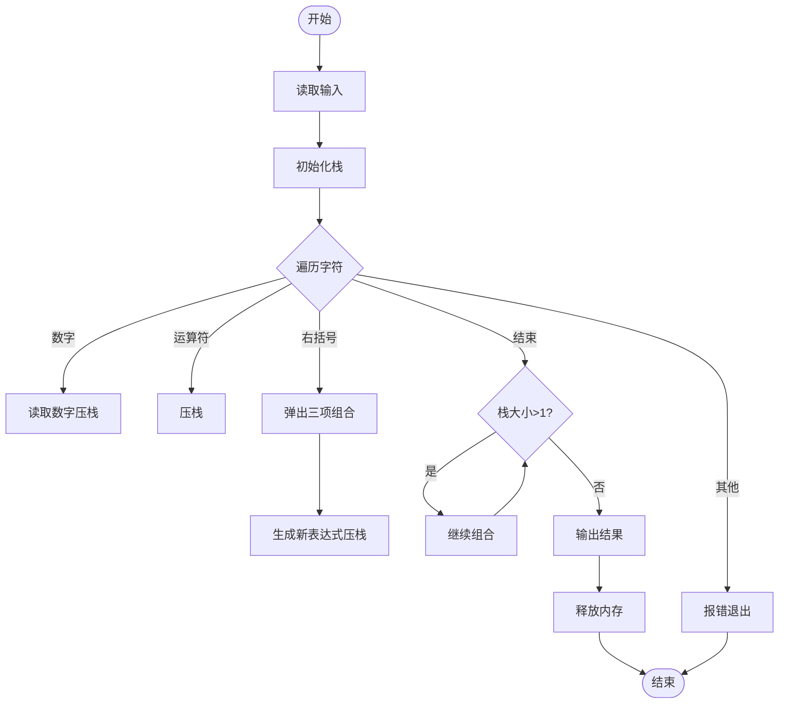
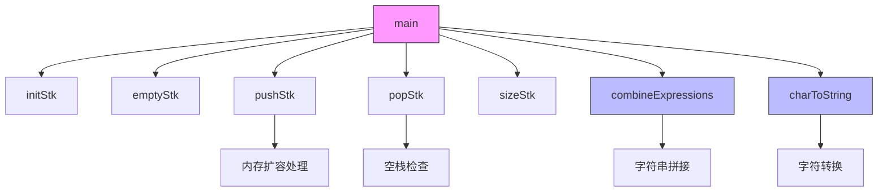

# 题目：括弧匹配问题——补全缺失左括号的中序表达式 

---

### 1. 需求分析 
**任务描述**： 
编写程序，从标准输入读取一个缺失左括号的中序表达式（如 `(1+2)*3-4)*5-6)`），补全缺失的左括号后输出完整表达式（如 `((1+2)*((3-4)*(5-6)))`）。  

**输入/输出要求**：  

- **输入形式**：一行字符串，包含数字、运算符（`+`, `-`, `*`, `/`）、括号（可能缺失左括号）。 
- **输出形式**：补全左括号后的中序表达式，保证所有右括号均有匹配的左括号。
- **值范围**：输入长度不超过 `MAX_INPUT_SIZE`（1000字符）。 

**功能要求**： 

1. 正确处理数字、运算符和括号。
2. 自动补全缺失的左括号，确保表达式语法正确。
3. 对非法输入（如无法匹配的右括号）报错。

**测试用例**：  

| 输入                   | 输出                        | 说明             |
| ---------------------- | --------------------------- | ---------------- |
| `1+23)*3-4712)*5-6)))` | `((1+23)*((3-4712)*(5-6)))` | 正常输入         |
| `1+2)*3`               | `(1+2)*3`                   | 单层补全         |
| `1+2`                  | `1+2`                       | 无括号，无需补全 |
| `1+)`                  | 报错：`表达式格式错误`      | 非法输入         |

---

### 2. 概要设计  
**解决思路**：  

1. **栈结构管理**：使用栈存储表达式片段（数字、运算符、子表达式）。  
2. **遍历输入**：逐个字符处理：  
   - 数字：连续读取完整个数并压栈。  
   - 运算符：转化成字符串并压栈。  
   - 右括号 `)`：弹出栈顶的右操作数、运算符、左操作数，组合为 `(left op right)` 并压栈。  
   - 左括号或空格：忽略。
3. **补全表达式**：扫描完成后，若栈中仍有多个片段，直接组合成表达式，无需补充括号。  

**数据结构**：  

```c
typedef struct {
    char **base;    // 栈底指针
    char **top;     // 栈顶指针
    int stacksize;  // 栈容量
} StackStr;
```

**模块关系**：  
- `initStk` / `pushStk` / `popStk`：栈的基本操作。  
- `combineExpressions`：合并子表达式并添加括号。  
- `main`：控制流程，处理输入/输出和错误检查。  

---

### 3. 详细设计  
**关键算法**：  
1. **栈操作**：动态扩容栈（`STACK_INCREMENT`），确保内存安全。  
2. **表达式合并**：  
   - 遇到 `)` 时，弹出 `right`、`op`、`left`，生成 `(left op right)`。  
   - 最终栈中剩余片段通过循环合并为完整表达式。  

**流程图**：  



**函数调用关系图**：



**调用关系说明**：

1. **核心调用链**：
   
   ```plaintext
   main → initStk → pushStk/popStk → combineExpressions → 输出结果
           ↑           ↑                ↑
           │           │                └─ charToString（处理运算符）
           │           └─ sizeStk/emptyStk（栈状态检查）
           └─ free（内存释放）
   ```
   
2. **关键模块功能**：
   - `initStk`：初始化字符串栈
   - `pushStk/popStk`：带动态扩容的栈操作
   - `combineExpressions`：生成带括号的子表达式
   - `charToString`：将运算符转为字符串格式

---

### 4. 调试分析  
**问题与解决**：  

1. **内存泄漏**：每次合并表达式后释放旧内存（`free(left/op/right)`）。  
2. **无法处理多位数**：添加数字的连续读入。
3. **缺少右括号时报错**：增添剩余表达式的合并。
4. **代码过于冗长**：将操作符转化成字符串，共用一个栈结构。
5. **复杂度**：时间复杂度 O(n)，空间复杂度 O(n)（栈动态扩容），n为表达式长度。  

**改进方向**：  

- 支持更多运算符（如 `^`）。  
- 支持更多括号种类。

---

### 5. 用户使用说明  
**运行环境**：`GCC 13.2.0`

编译运行后，输入一个待补全的表达式，括号只能是英文圆括号，运算符只能是英文字符中的 `+-*/`，按下回车后程序将会自动输出补全后的中序表达式。注意，输入表达式长度需要小于等于1000，否则会溢出。

**输入示例**：  

```plaintext
1+23)*3-4712)*5-6)))
```
**输出示例**：  

```plaintext
((1+23)*((3-4712)*(5-6)))
```

---

### 6. 测试结果  
| 输入                          | 输出                     |
| ----------------------------- | ------------------------ |
| `1+2)*3+4)*5+6)))`            | `((1+2)*((3+4)*(5+6)))`  |
| `1 + 23) / 148 + 18342 - 0))` | `(1+23)/(148+(18342-0))` |
| `12 + 3)*48`                  | `(12+3)*48`              |

---

