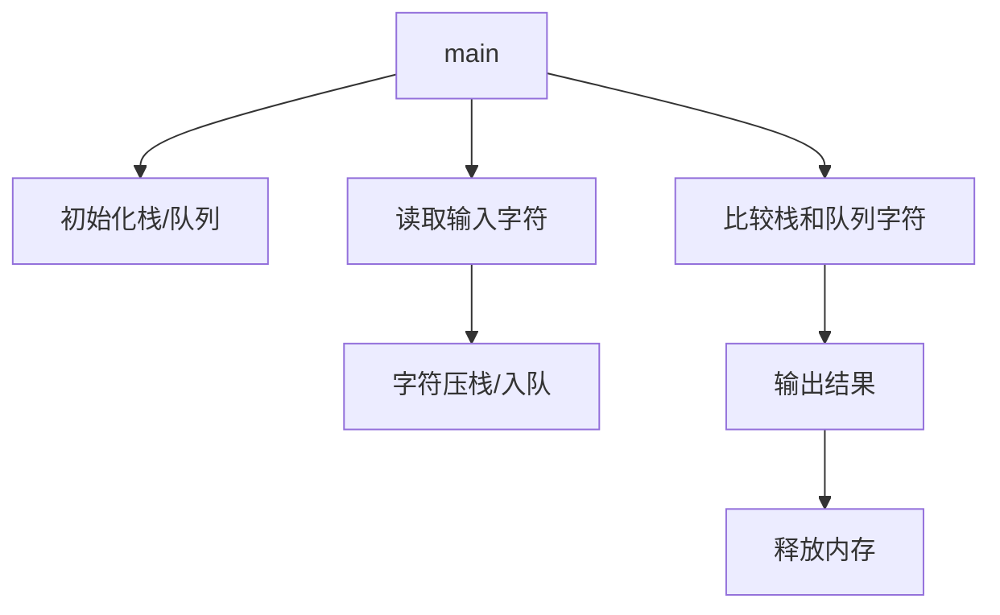
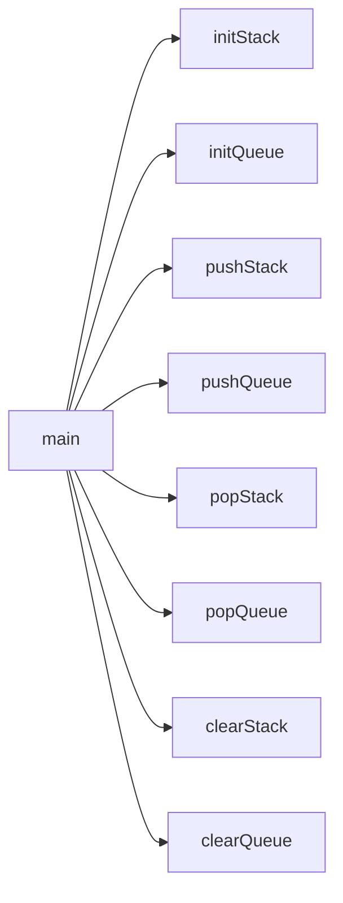

# 题目：判别回文字符串（栈和队列实现） 

---

### 1. 需求分析  
**任务描述**：  
- 使用栈和队列判断输入的字符串是否为回文（正读反读相同），以 `#` 作为输入结束标志。  

**输入/输出**：  
- **输入形式**：从键盘逐字符输入，以 `#` 结尾（如 `abcba#`）。  
- **输出形式**：打印 `YES`（是回文）或 `NO`（非回文）。  
- **值范围**：输入长度 ≤ `MAX_INPUT_SIZE`（1000字符）。  

**功能要求**：  
1. 动态存储输入字符至栈和队列。  
2. 通过比较栈（后进先出）和队列（先进先出）的字符判断回文。  
3. 处理内存分配错误和空栈/队列异常。  

**测试数据**：  
| 输入类型 | 测试用例 | 预期输出 | 实际输出 | 说明           |
| -------- | -------- | -------- | -------- | -------------- |
| 合法回文 | `ababa#` | `YES`    |          | 奇数长度       |
| 合法回文 | `abba#`  | `YES`    |          | 偶数长度       |
| 非法回文 | `abc#`   | `NO`     |          | 非回文         |
| 空输入   | `#`      | `YES`    |          | 空字符串算回文 |

---

### 2. 概要设计  
**解决思路**：  
- **栈**（后进先出）反转字符顺序，**队列**（先进先出）保持原顺序，通过比较两者字符判断回文。  

**数据结构**：  
```c
// 栈定义
typedef struct {
    char *top, *base;
    int size;
} Stack;

// 队列定义（链表实现）
typedef struct QNode {
    char data;
    struct QNode *next;
} QNode;
typedef struct {
    QNode *head, *tail;
} Queue;
```

**模块划分**：  


---

### 3. 详细设计  
**关键算法伪代码**：  

```python
def is_palindrome():
    stack, queue = init_stack(), init_queue()
    while (c := getchar()) != '#':
        push_stack(stack, c)
        push_queue(queue, c)
    
    while not empty_stack(stack) and not empty_queue(queue):
        if pop_stack(stack) != pop_queue(queue):
            return False
    return True
```

**函数调用关系**：  



---

### 4. 调试分析  
**问题与解决**：  

- 对于C语言的一些语法有问题，通过询问大模型解决。本实验涉及的算法和数据结构过于显然直白，未遇到问题。

**改进设想**：  
- 可优化为仅需一半字符比较。

**复杂度分析**：

- 时间复杂度：$O(n)$
- 空间复杂度：$O(n)$

---

### 5. 用户使用说明  

**运行环境**：`GCC 13.2.0`

**操作步骤**：  

1. 编译：`gcc -o palindrome palindrome.c`  
2. 运行：`./palindrome`  
3. 输入：键入ascii码字符串，以 `#` 结尾（如 `level#`），按回车显示结果，字符串长度需要少于1000。

---

### 6. 测试结果  
| 输入       | 预期输出 | 实际输出 |
| ---------- | -------- | -------- |
| `racecar#` | `YES`    | `YES`    |
| `hello#`   | `NO`     | `NO`     |
| `a#`       | `YES`    | `YES`    |

---