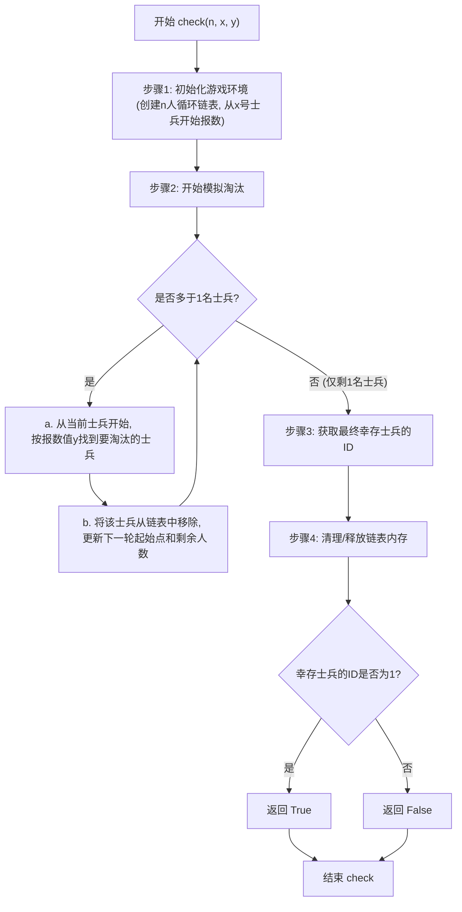
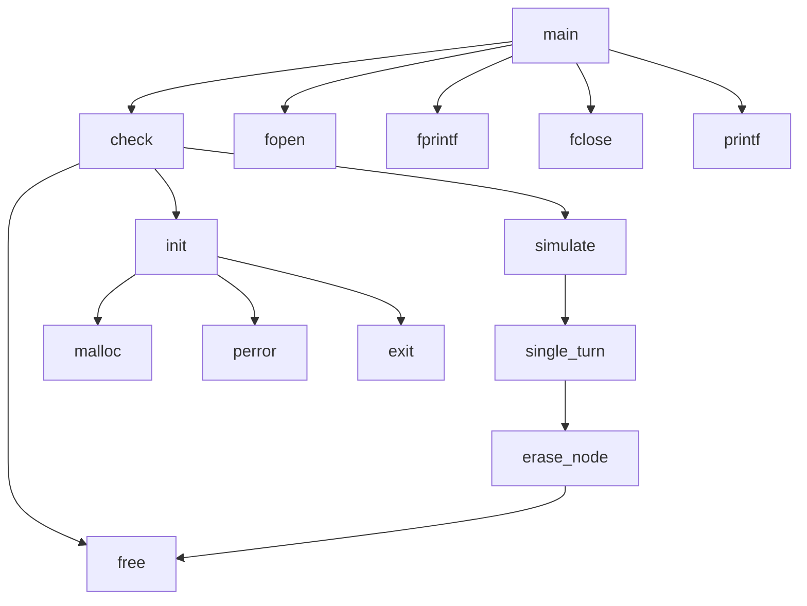

# 题目：加里森的任务

---

### 1. 需求分析 

**任务描述**： 

有n个加里森敢死队的队员要炸掉敌人的一个军火库，谁都不想去，队长加里森决定用轮回数数的办法来决定哪个战士去执行任务。规则如下：如果前一个战士没完成任务，则要再派一个战士上去。现给每个战士编一个号，大家围坐成一圈，随便从某一个编号为x的战士开始计数，当数到y时，对应的战士就去执行任务，且此战士不再参加下一轮计数。如果此战士没完成任务，再从下一个战士开始数数，被数到第y时，此战士接着去执行任务。以此类推，直到任务完成为止。

加里森本人是不愿意去的，假设加里森为1号，请你设计一个程序为加里森支招，求出n,x,y满足何种条件时，加里森能留到最后而不用去执行任务。要求主要数据结构采用链式结构存储。

**输入输出要求：**

无

**功能要求**： 

1. 给定n,x,y能正确判断加里森是否存活。
2. 生成多组使得加里森存活的(n,x,y)以观察规律。

**测试用例**：  

无


### 2. 概要设计  

**解决思路**：  

1. 使用循环链表存储每个存活士兵的编号。
1. 按照题意模拟士兵数数的过程。
1. 数到y的士兵从循环链表中删除。
1. 重复上述过程直到只剩下一名士兵。

**数据结构**：  

使用循环链表存储

```c
typedef struct node {
    int id;
    struct node *pre, *next;
} Node, *Link;
```

**模块关系**：  

- **`struct node` (`Node`, `Link`)**:
  - 定义链表节点，存储士兵ID及前后指针。头节点ID特殊用于计数。
- **`Link init(int n, int x)`**:
  - **初始化**: 创建含 `n` 名士兵的循环链表，设置从 `x` 号士兵开始，并返回头节点。
- **`void erase_node(Link head, Link x)`**:
  - **删除节点**: 从链表中移除士兵 `x`，更新头节点状态（计数、下一轮起始点）。
- **`void single_turn(Link head, int y)`**:
  - **单轮淘汰**: 根据报数值 `y` 找到并淘汰一名士兵。
- **`int simulate(Link head, int y)`**:
  - **完整模拟**: 执行多轮淘汰，直至仅剩一名士兵，返回其ID。
- **`bool check(int n, int x, int y)`**:
  - **存活检查**: 判断在参数 `n`, `x`, `y` 下，1号士兵是否最终存活。
- **`int main()`**:
  - **主程序**: 遍历多组 `(n, x, y)` 参数，调用 `check` 找出1号士兵的存活条件并输出到文件。

### 3. 详细设计  

**关键算法**：  

- 模拟士兵循环报数和被选中的过程，直到只剩下一名士兵，判断是否是1号士兵。遍历n，x，y，模拟整个过程，将满足要求（1号存活）的三元组写入文件。
- 使用python，将合法的(n, x, y)三元组画在一个三维的散点图上，观察结果。

**流程图**：  




**函数调用关系图**：



**核心数据结构**

- ```c
  typedef struct node {
      int id;
      struct node *pre, *next;
  } Node, *Link;
  ```

- 定义了双向循环链表的节点结构。
  
  - `id`: 存储士兵的编号。
  - `pre`: 指向前一个节点的指针。
  - `next`: 指向下一个节点的指针。
  - 注释中提到头节点的 `id` 用来存储剩余节点数目，这是一个特殊用途。

**函数说明**

1. **`Link init(int n, int x)`**:
   - **作用**: 初始化一个包含 `n` 个士兵的循环链表，用于约瑟夫问题的模拟。
   - 功能:
     - 创建一个哨兵头节点（`head`），并将其 `id` 设置为士兵总数 `n`。
     - 创建 `n` 个士兵节点，编号从 1 到 `n`，并将它们链接成一个双向循环链表。
     - 将 `head` 节点的 `next` 指针指向编号为 `x` 的士兵节点，作为报数的起始位置。
     - 将 `head` 节点的 `pre` 指针指向编号为 `x` 的士兵节点的前一个节点。
     - 返回指向头节点的指针 `head`。
2. **`void erase_node(Link head, Link x)`**:
   - **作用**: 从循环链表中删除指定的士兵节点 `x`。
   - 功能:
     - 将被删除节点 `x` 的下一个节点设置为新的报数起始点（更新 `head->next`）。
     - 更新 `head->pre` 指向新的报数起始点的前一个节点。
     - 将 `head->id`（剩余士兵数）减 1。
     - 将被删除节点 `x` 从链表中移除（更新 `x` 的前驱和后继节点的指针）。
     - 释放被删除节点 `x` 的内存。
3. **`void single_turn(Link head, int y)`**:
   - **作用**: 执行一轮报数并淘汰一名士兵。
   - 功能:
     - 从 `head->next` 指向的当前士兵开始。
     - 从当前士兵开始，向前移动相应的步数找到要淘汰的士兵。
     - 调用 `erase_node` 函数淘汰该士兵。
4. **`int simulate(Link head, int y)`**:
   - **作用**: 模拟整个约瑟夫问题的过程，直到只剩下一名士兵。
   - 功能:
     - 当剩余士兵数 (`head->id`) 大于 1 时，循环调用 `single_turn` 函数执行报数和淘汰。
     - 返回最后幸存的士兵的编号 (`head->next->id`)。
5. **`bool check(int n, int x, int y)`**:
   - **作用**: 检查在给定总人数 `n`、起始报数士兵编号 `x` 和报数值 `y` 的条件下，1号士兵是否能最终存活。
   - 功能:
     - 调用 `init` 函数初始化链表。
     - 调用 `simulate` 函数模拟约瑟夫问题。
     - 释放 `head` 节点（注意：在你的原始代码中，`simulate` 后只剩下一个节点，也需要释放，或者在 `check` 中统一处理）。
     - 如果最后幸存的士兵编号为 1，则返回 `true`，否则返回 `false`。
     - *你在最新的代码中已经添加了对 `head` 的 `free` 操作，很好。但 `simulate` 后返回的 `head->next` 指向的最后一个节点也需要释放，这通常在 `check` 函数中、获取其 `id` 之后进行。*
6. **`int main()`**:
   - **作用**: 程序主入口，用于执行一系列约瑟夫问题模拟，并将1号士兵存活的 `(n, x, y)` 参数组合输出到文件。
   - 功能:
     - 打开一个名为 `josephus_survivors.txt` 的文件用于写入结果。
     - 定义模拟的参数范围（`n_max`, `y_max`）。
     - 使用三层嵌套循环遍历不同的 `n`（总人数）、`x`（起始报数士兵编号）和 `y`（报数值）的组合。
     - 对于每种组合，调用 `check` 函数判断1号士兵是否存活。
     - 如果1号士兵存活，则将该 `(n, x, y)` 组合写入文件。
     - 关闭文件。

---

### 4. 调试分析  

**问题与解决**：  

1. 一开始在栈空间分配节点内存，导致循环链表的初始化有误，改用malloc后解决。
1. 要求使用链式结构存储，每次都模拟实际过程，check一次的时间复杂度为 $O(n^2)$，耗时太大，因此只能模拟小规模数据。实际上，约瑟夫问题有 $O(n)$ 以及 $O(y \log{n})$ 的解法，但是限于实验要求，未能实现。

**改进方向**：  

- 实现一个跳表，每个节点预处理后继距离 $2^i$ 的节点并在删除节点时动态更新，可将模拟的过程进行优化，将单次模拟时间复杂度优化到 $O(n \log n)$。

---

### 5. 用户使用说明  

**运行环境**：`GCC 13.2.0`，`python3.12.7`

**依赖第三方库：**pandas、matplotlib

**使用说明：**

- 编译运行Chp2Exp1.c文件生成数据，然后运行draw.py文件绘图。
- Chp2Exp1.c文件中main函数里的n_max和y_max为模拟的最大值，可以相应调整，但是由于程序复杂度较高，不宜过大。
- 运行python程序之前需要安装相应的依赖。

### 6. 测试结果

- Chp2Exp1.c

  ```powershell
  开始模拟 (n_max=25, y_max=25)...
  已完成对 n = 5 的所有模拟。
  已完成对 n = 10 的所有模拟。
  已完成对 n = 15 的所有模拟。
  已完成对 n = 20 的所有模拟。
  已完成对 n = 25 的所有模拟。
  数据生成完毕。结果保存在 josephus_survivors.txt 文件中。
  ```

- draw.py

  

通过观察三维散点图，我们可以发现一些规律：

- 大部分的点杂乱无章。

- 固定y时，(n,x) 分布在一系列平行直线上，如下图：

  

- y越大，(n,x)在直线上的分布越稀疏。

- 固定n时，未能观察到明显规律，如下图：

  

- 当x=1，y=2时，n只有是2的幂次才满足条件。

