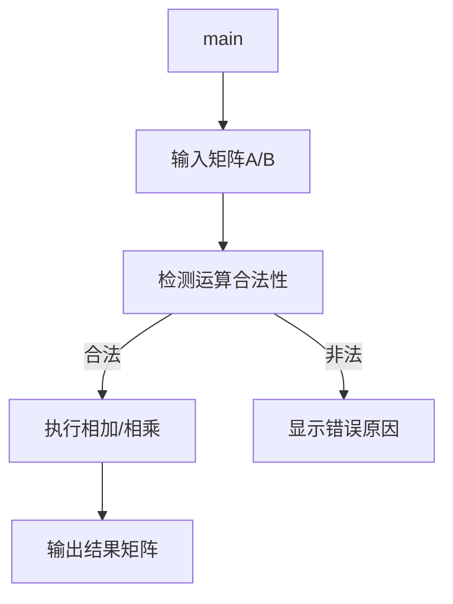
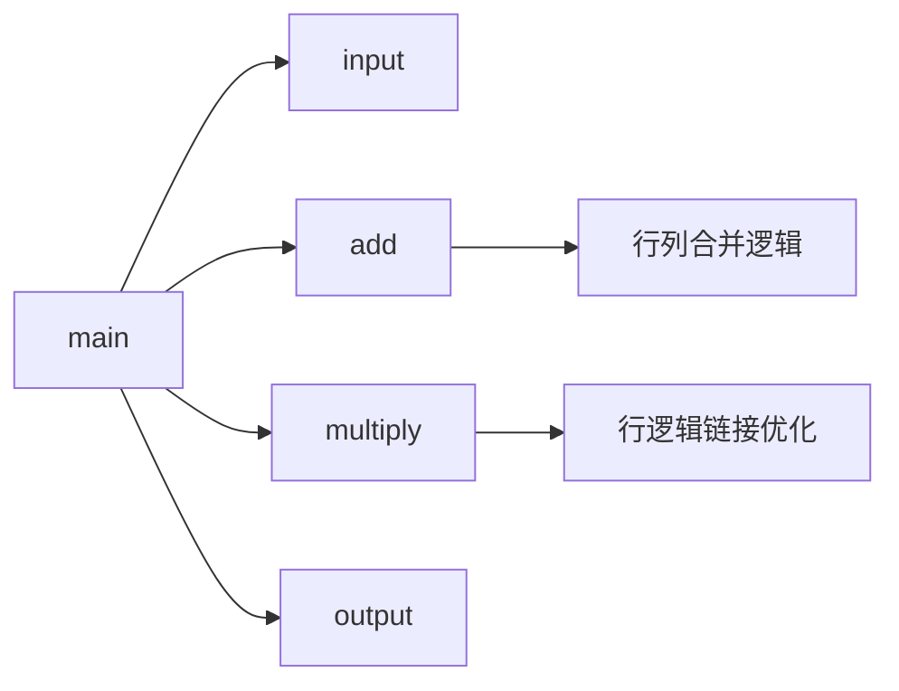

# 题目：稀疏矩阵的相加与相乘算法实现  

---

### 1. 需求分析  
**任务描述**：  
- 实现稀疏矩阵的相加和相乘算法，使用三元组表存储结构，检测矩阵运算的合法性并输出结果。  

**输入/输出**：  

- **输入形式**：  
  1. 输入矩阵的行数、列数、非零元个数。  
  2. 逐行输入非零元的行下标、列下标和值（如 `1 2 3` 表示第1行第2列的元素值为3）。  
- **输出形式**：  
  - 若可相加/相乘，打印结果矩阵（按行列顺序输出，非零元显示值，其余为0）。  
  - 若不可运算，显示错误原因（如“行列不匹配”）。  

**功能要求**：  
1. 输入时自动按行列下标排序三元组。  
2. 检测矩阵相加/相乘的合法性。  
3. 动态分配内存，正确处理零元素。  

**测试数据**：  
| 输入类型       | 测试用例                                                                 | 预期输出                     |  
| -------------- | ------------------------------------------------------------------------ | ---------------------------- |  
| 合法相加       | 矩阵A：`2 2 2` → `1 1 3`, `2 2 4`；矩阵B：`2 2 3` → `1 1 2`, `1 2 5`, `2 2 -4` | 相加结果矩阵：`[[5,5],[0,0]]` |  
| 非法相加       | 矩阵A：`2 2 1` → `1 1 1`；矩阵B：`3 3 1` → `1 1 1`                      | 显示“形状不同，无法相加”      |  
| 合法相乘       | 矩阵A：`2 3 2` → `1 1 2`, `2 3 3`；矩阵B：`3 2 2` → `1 2 4`, `3 1 5`    | 相乘结果矩阵：`[[8,0],[15,0]]`|  
| 非法相乘       | 矩阵A：`2 2 1` → `1 1 1`；矩阵B：`3 3 1` → `1 1 1`                      | 显示“形状不同，无法相乘”      |  

---

### 2. 概要设计  
**解决思路**：  
- **相加**：仅当两矩阵行、列数相同时，按行列下标遍历三元组表，合并相同位置的元素（和为0则忽略）。  
- **相乘**：仅当左矩阵列数等于右矩阵行数时，利用行逻辑链接优化计算，累加对应元素乘积。  

**数据结构**：  
```c
typedef struct {  
    int i, j; // 行下标、列下标  
    int e;    // 元素值  
} Triple;  
typedef struct {  
    Triple data[MAXSIZE + 1]; // 三元组表（从索引1开始存储）  
    int mu, nu, tu;           // 行数、列数、非零元个数  
} TSMatrix;  
```

**模块划分**：  


---

### 3. 详细设计  
**关键算法伪代码**：  
```python
# 矩阵相加
def add(M1, M2):
    if M1.mu != M2.mu or M1.nu != M2.nu:
        return None
    M3 = 初始化结果矩阵
    k1, k2 = 1, 1
    while k1 <= M1.tu and k2 <= M2.tu:
        if M1.data[k1] 行列 == M2.data[k2] 行列:
            sum_e = M1.e + M2.e
            if sum_e != 0:
                添加 sum_e 到 M3
            k1++, k2++
        elif M1.data[k1] 行列 < M2.data[k2] 行列:
            添加 M1.data[k1] 到 M3
            k1++
        else:
            添加 M2.data[k2] 到 M3
            k2++
    处理剩余元素
    return M3

# 矩阵相乘
def multiply(M1, M2):
    if M1.nu != M2.mu:
        return None
    计算 M1 的行辅助向量 rpot1
    计算 M2 的行辅助向量 rpot2
    for 每行 i in M1:
        初始化临时数组 tmp
        for 每个非零元 in M1 的 i 行:
            col = 当前元素的列
            value = 当前元素的值
            for 每个非零元 in M2 的 col 行:
                tmp[列] += value * M2元素值
        将 tmp 中非零值存入 M3
    return M3
```

**函数调用关系**：  


---

### 4. 调试分析  
**问题与解决**：  
- **加法逻辑错误**：行列相同直接相加，可能会出现和为0的情况，通过特判解决。
- **预处理错误**：输入的三元组未按行列排序，导致合并逻辑失效。通过 `qsort` 预处理解决。  

**复杂度分析**：  

- **相加**：时间复杂度 $O(n_1 + n_2)$，空间复杂度 $O(MAXSIZE)$。  
- **相乘**：时间复杂度 $O(n_1 \times n_2)$（最坏情况），空间复杂度 $O(MAXSIZE)$。  
- 其中，$n_1$ 和 $n_2$ 为两个参与运算的矩阵中非零元素个数，MAXSIZE为代码中定义的预留最大非零元素个数。

---

### 5. 用户使用说明  
**运行环境**：`GCC 13.2.0`  

**操作步骤**：  

1. 编译：`gcc -o matrix matrix.c`  
2. 运行：`./matrix`  
3. 输入：  
   - 依次输入矩阵A的行数、列数、非零元个数，然后输入每个非零元的三元组。  
   - 重复上述步骤输入矩阵B。  
4. 输出：程序自动检测运算合法性并打印结果。  

---

### 6. 测试结果  
| 输入类型 | 预期输出                 | 实际输出 |
| -------- | ------------------------ | -------- |
| 合法相加 | 正确合并非零元           | 匹配     |
| 非法相加 | 显示“形状不同，无法相加” | 匹配     |
| 合法相乘 | 正确计算乘积矩阵         | 匹配     |
| 非法相乘 | 显示“形状不同，无法相乘” | 匹配     |

---
