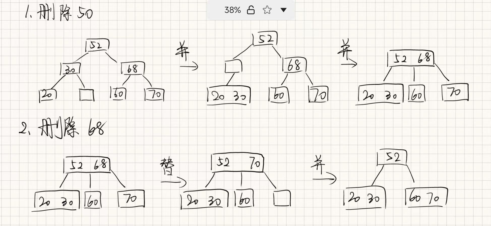

# 数据结构第八章作业

---

## 第一题

包括n个关键码的m阶B-树在一次检索中最多涉及多少个结点？（要求写出推导过程。）

**解:**

涉及的结点个数最多为树的高度。

假设每层每个点都有最少的关键字，此时树的高度达到最大。

第一层，1个结点，1个关键字；第二层，2个结点，$2\lceil m/2-1\rceil$ 个关键字；第三层，$2 \lceil m/2\rceil$ 个结点，$2\lceil m/2\rceil \lceil m/2-1\rceil$ 个关键字。

第L层，$2 \lceil m/2\rceil^{L-2}$ 个结点，$2\lceil m/2\rceil^{L-2} \lceil m/2-1\rceil$ 个关键字。

将每一层关键字个数相加，得到 $N = 2\lceil m/2 \rceil^{L-1}-1$ .

从而总共涉及 $L = \log_{\lceil m/2 \rceil} \left( \frac{(N+1)}{2} \right) + 1$ 个结点.

---

## 第二题

试从空树开始，画出按以下次序向3阶B-树中插入关键码的建树过程：20，30，50，52，60，68，70。如果此后删除50和68，画出每一步执行后B-树的状态。

**解：**

建树过程：


删除过程：



---

## 第三题

已知二叉树排序树中某结点指针p，其双亲结点指针为fp，p为fp的左孩子，试编写算法，删除p所指结点。

**解：**

当p的左右孩子有一个为空时，直接让另一个孩子作为fp的孩子；当左右孩子都为空时，fp的孩子为空。

当p的左右孩子都存在时，将p的左孩子中的最大结点与p进行交换，同时修改其父节点的连接关系。

```c
typedef struct node {
    int data;
    struct node *left, *right;
} BiTNode, *BiTree;

void Delete(BiTree &root, BiTree p, BiTree fp) {
    if (p->left == NULL) {
        fp->left = p->right;
        free(p);
    } else if (p->right == NULL) {
        fp->left = p->left;
        free(p);
    } else {
        BiTree fu = p, u = p->left;
        while (u->right != NULL) {
            fu = u;
            u = u->right;
        }
        p->data = u->data;
        if (fu == p) fu->left = u->left;
        else fu->right = u->left;
        free(u);
    }
}
```

---

## 第四题

试画出从空树开始，由字符序列(t,d,e,s,u,g,b,j,a,k,r,i)构成的二叉平衡树，并为每一次的平衡处理指明旋转类型。

**解：**


---

## 第五题

已知含12个关键字的有序表及其相应权值为：

| 序号   | 1    | 2    | 3    | 4    | 5    | 6    | 7    | 8    | 9    | 10   | 11   | 12   |
| ------ | ---- | ---- | ---- | ---- | ---- | ---- | ---- | ---- | ---- | ---- | ---- | ---- |
| 关键字 | A    | B    | C    | D    | E    | F    | G    | H    | I    | J    | K    | L    |
| 权值   | 4    | 6    | 3    | 4    | 9    | 3    | 2    | 6    | 1    | 5    | 3    | 4    |

(1) 画出对以上有序表进行折半查找的判定树，求折半查找时查找成功的平均查找长度ASL。

(2) 若为等概率查找，求折半查找时查找成功的平均查找长度ASL。

**解：**

(1) 


（2）
$$
ASL=\frac{1 \times 1 + 2 \times 2 + 3 \times 4 + 4 \times 5}{12} = 3.083
$$


---

## 第六题

假设一棵平衡二叉树的每个结点都标明了平衡因子bf，试设计一个算法，利用bf值求平衡二叉树的高度。`int Height(BSTree t)`

**解：**

利用bf的值，选择高度较小的分支进入。每次只用进入一个分支，复杂度 $O(\log n)$。

 ```c
 typedef struct node {
     int data, bf;
     struct node *left, *right;
 } BSTNode, *BSTree;
 int Height(BSTree t) {
     if (t == NULL) return 0;
     if (t->bf > 0) {
         return Height(t->right) + t->bf + 1;
     } else {
         return Height(t->left) - t->bf + 1;
     }
 }
 ```


## 第七题

选取哈希函数H(k)=(3k) MOD 11。

1) 用线性探测开放定址法处理冲突，
2) 用链地址法处理冲突

试在0~10的散列地址空间中对关键字序列(22, 41, 53, 46, 30, 13, 01, 67)造哈希表，并求等概率情况下查找成功时的平均查找长度和不成功时的平均查找长度以及装填因子α。

**解：**

1. 线性探测再散列：

   

   成功时，$ASL_s=(1+1+2+2+1+1+2+6)/8=2$.

   不成功时，$ASL_f=(2+1+8+7+6+5+4+3+2+1+1)/11=3.636$.

   装填因子 $\alpha = 8/11 = 0.727$.

2. 链地址法：

   

   成功时，$ASL_s=(5\times 1+3\times2)/8=1.375$.

   不成功时，$ASL_f=(2+1+3+3+1+2+3+1+1+1+1)/11=1.727$.

   装填因子 $\alpha = 8/11 = 0.727$.

