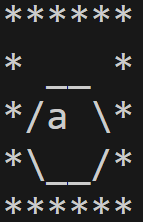
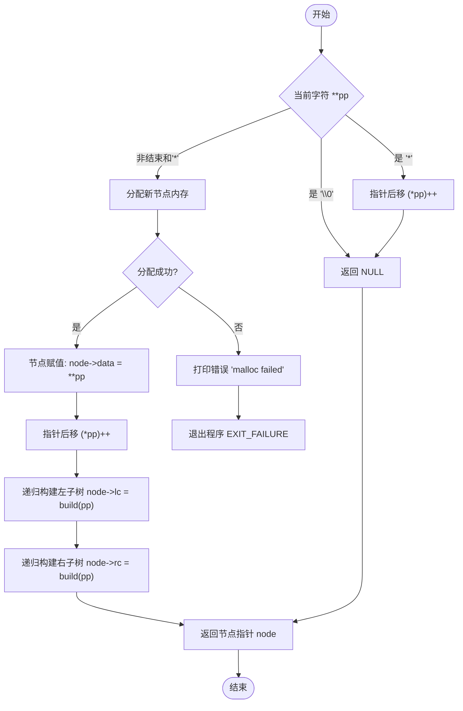
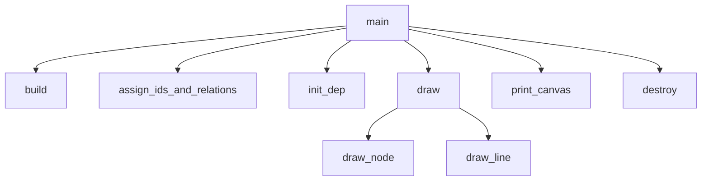

# 题目：先序递归建立二叉树

---

### 1. 需求分析 

**任务描述**： 
用先序递归过程建立二叉树（存储结构：二叉链表），要求：输出二叉树的四种表示法之一。

**输入/输出要求**：  

- **输入形式**：一行字符串，表示先序序列，`*`代表空树，如：`abc**d**e**` 。

- **输出形式**：二叉树的四种表示法之一。本实验选择树形表示法，画出二叉树对应的字符画，定义如下：

  - 对于满二叉树：

    1. 定义 1 级满二叉树的字符画为一个带有节点编号的六边形字符画，宽度 $w(1) = 4$，高度 $h(1) = 3$，二叉树的深度 $d(1) = 1$；

    2. 定义 $i (i > 1)$ 级满二叉树的字符画为两个 $i - 1$ 级满二叉树的字符画间隔两个空格左右拼接到一起，然后从最上方的两个节点分别使用 '/' 和 '\' 字符向中心聚拢，并且相聚时 1 级满二叉树的字符画表示根节点，宽度 $w(i) = (w(i - 1) + 1) \times 2$，高度 $h(i) = 3 \times 2^{i - 1}$，二叉树的深度 $d(i) = i$；

    如下图所示为2级满二叉树：

    

    如下图所示为3级满二叉树：

    

  - 对于非满二叉树：其图像是满二叉树的情况，移除不存在的节点和边，并替换为空格字符。
  - 为便于观察，在输出图形最外层添加`*`包裹。

- **值范围**：输入长度小于 100字符。结点编号为单字符的ASCII字符，*表示空树。

- **特殊情况**：如果输入的是空树`*`。则输出一行字符串`Empty tree!`。

**功能要求**： 

1. 根据输入的先序序列正确构建二叉树。
2. 根据构建的二叉树正确输出其树形表示法。

**测试用例**：  

| 输入        | 输出                                                         | 说明       |
| ----------- | ------------------------------------------------------------ | ---------- |
| `*`         |  | 空树       |
| `a**`       |  | 单结点的树 |
| `abc**d**e` |  | 一般情况   |

---

### 2. 概要设计  

**解决思路**：  

1. 使用先序递归的方法建树。
2. 记录树的深度、结点父子关系等信息。
3. 画出单个结点的字符画。
4. 根据父子关系画出边的连接关系。
5. 使用*包裹字符画。
6. 打印字符画树形图。

**数据结构**：  

使用二叉链表存储

```c
typedef struct BiTNode {
    ElemType data;
    struct BiTNode *lc, *rc;
    int id;             // 编号字段，用于字符画
} BiTNode, *BiTree;
```

**模块关系**：  

- `build`：使用先序递归建立二叉树。
- `assign_ids_and_relations`：先序遍历二叉树，给结点编号并处理深度和父子关系。
- `draw_node`：画出单个结点的字符画。
- `draw_line`：画出两个结点之间的边。
- `draw`：根据父子关系和深度，调用`draw_node`和`draw_line`画出整颗二叉树。
- `print_canvas`：画出二叉树周围的*。
- `destroy`：销毁二叉树。
- `main`：主函数，根据输入建树、画树并退出。

---

### 3. 详细设计  

**关键算法**：  

建树的过程是本实验的核心，采用先序递归的算法进行建树。

build函数的职责是，构建当前后缀字符串所对应的树。当遍历到字符串末尾时，返回空树；当遍历到*时，返回空树并让指针指向下一个字符；否则以当前字符建立根节点，递归构建左子树和右子树。

**流程图**：  



**函数调用关系图**：



**调用关系说明**：

- **`main`**
  - 首先调用 **`build`**(char **pp) 递归构建二叉树结构。
  - 接着调用 **`assign_ids_and_relations`**(BiTree u, int depth) 为每个节点分配编号、填充 `lson[]`/`rson[]`/`fa[]`，计算整棵树的最大深度。
  - 然后调用 **`init_dep`**(int u, int d) 自上而下计算每个节点绘图时的垂直偏移量，`init_dep` 本身递归遍历所有编号节点。
  - 调用 **`draw`**(int u, int x, int y) 在画布上绘制节点和连线，过程中会：
    - 调用 **`draw_node`**(int i, int j, int num) 画单个节点的框和编号字符；
    - 调用 **`draw_line`**(int x, int y, int u, int v, char c) 画从父节点到子节点的连线；
    - 并递归调用自身来绘制所有子树。
  - 调用 **`print_canvas`**() 扫描并输出画布内容，用 `*` 绘制边框。
  - 最后调用 **`destroy`**(BiTree root) 递归释放所有树节点，避免内存泄漏。
- **`build`**
  - 根据先序带 `*` 标记的字符串，递归创建左右子节点，直到读到 `'\0'` 或 `'*'` 为止。
- **`assign_ids_and_relations`**
  - 深度优先遍历二叉树，
    - 为每个节点生成自增 `id`，
    - 记录其左右孩子编号到 `lson[id]`/`rson[id]` 并设置 `fa[child] = id`，
    - 按需更新全局 `tree_depth`。
- **`init_dep`**
  - 以根节点为起点，按层级调用自身，
  - 使用全局深度 `k` 计算每个节点向下绘制时的高度间隔 `dep[u] = get_hight(k - depth)`。
- **`draw`**
  - 对每个节点调用 `draw_node`，
  - 对每条父子关系调用 `draw_line`，
  - 并递归绘制其左右子树。
- **`draw_node`**
  - 负责在二维数组 `a` 上按固定格式绘制节点外框和编号字符。
- **`draw_line`**
  - 负责在二维数组 `a` 上绘制从 `(x,y)` 到 `(u,v)` 的对角线，作为父子连线。
- **`print_canvas`**
  - 扫描 `a` 数组中非空字符的边界，
  - 在边界用 `*` 输出外框，其余位置输出原有字符。
- **`destroy`**
  - 后序遍历释放二叉树所有节点，回收内存。

---

### 4. 调试分析  

**问题与解决**：  

1. 一开始使用数组下标来访问字符串，过于繁琐，改用`char*`和`char**`。
2. 字符画一开始没考虑空树的情况，空树时会输出乱码，改为特判，输出`Empty Tree!`。

**改进方向**：  

- 支持更多二叉树的表示法。

---

### 5. 用户使用说明  

**运行环境**：`GCC 13.2.0`

编译运行后，输入一行使用*表示空树的先序序列字符串。

**输入示例**：  

```plaintext
abc**d**e
```

**输出示例**：  

```plaintext
*********************
*           __      *
*          /a \     *
*          \__/     *
*          /  \     *
*         /    \    *
*      __/      \__ *
*     /b \      /e \*
*     \__/      \__/*
*     /  \          *
*    /    \         *
* __/      \__      *
*/c \      /d \     *
*\__/      \__/     *
*********************
```

---

### 6. 测试结果  

---

输入1：

```plaintext
ABC**D**EF**G**
```

输出1：

```
************************
*          __          *
*         /A \         *
*         \__/         *
*         /  \         *
*        /    \        *
*       /      \       *
*    __/        \__    *
*   /B \        /E \   *
*   \__/        \__/   *
* __/  \__    __/  \__ *
*/C \  /D \  /F \  /G \*
*\__/  \__/  \__/  \__/*
************************
```

输入2：

```
abcd**ef**g****
```

输出2：

```
************************************************
*                                           __ *
*                                          /a \*
*                                          \__/*
*                                          /   *
*                                         /    *
*                                        /     *
*                                       /      *
*                                      /       *
*                                     /        *
*                                    /         *
*                                   /          *
*                                  /           *
*                                 /            *
*                                /             *
*                               /              *
*                              /               *
*                             /                *
*                            /                 *
*                           /                  *
*                          /                   *
*                         /                    *
*                        /                     *
*                       /                      *
*                      /                       *
*                   __/                        *
*                  /b \                        *
*                  \__/                        *
*                  /                           *
*                 /                            *
*                /                             *
*               /                              *
*              /                               *
*             /                                *
*            /                                 *
*           /                                  *
*          /                                   *
*       __/                                    *
*      /c \                                    *
*      \__/                                    *
*      /  \                                    *
*     /    \                                   *
*    /      \                                  *
* __/        \__                               *
*/d \        /e \                              *
*\__/        \__/                              *
*          __/  \__                            *
*         /f \  /g \                           *
*         \__/  \__/                           *
************************************************
```

输入3：

```
$**
```

输出3：

```
******
* __ *
*/$ \*
*\__/*
******
```

输入4：

```
*
```

输出4：

```
Empty tree!
```

经测试，满二叉树、非满二叉树、单个结点的树、空树、特殊字符编号均能正确输出结果。
