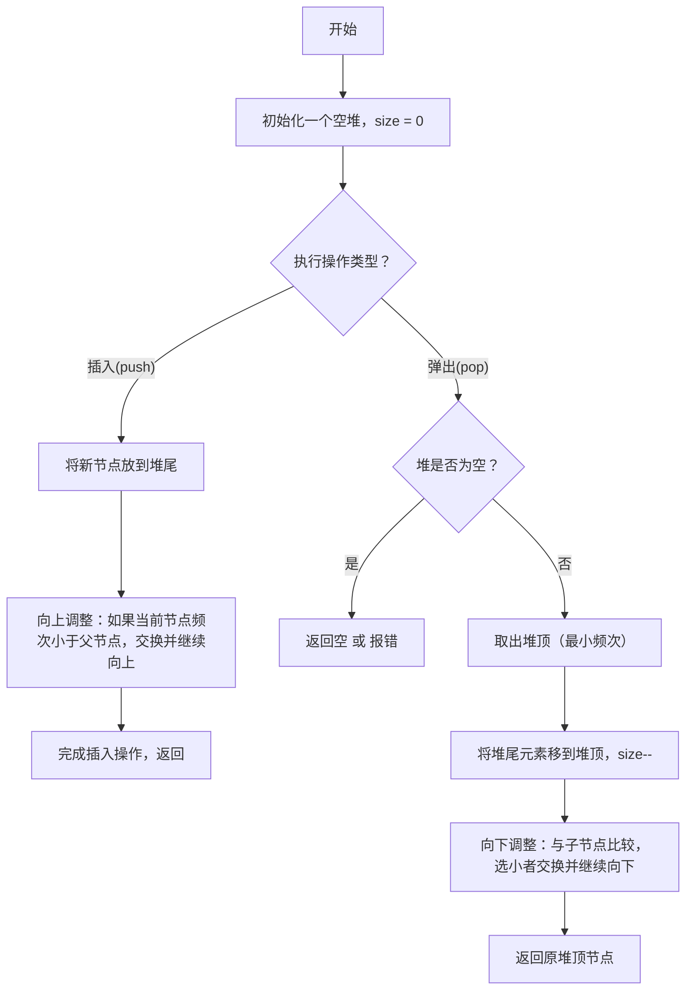
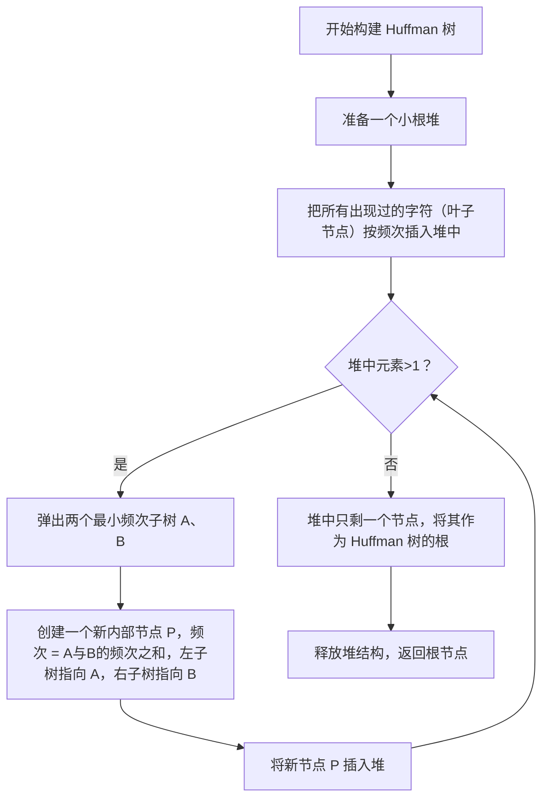
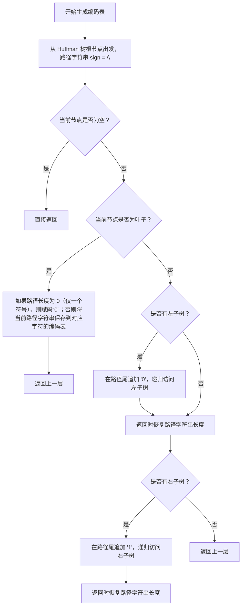
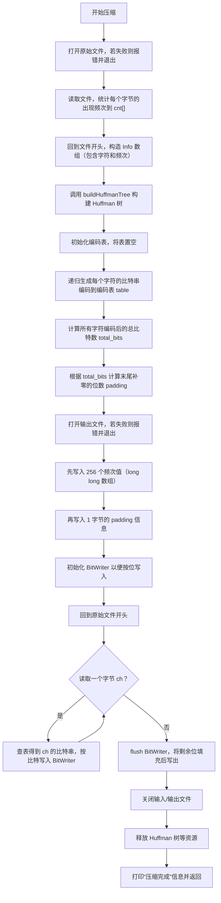
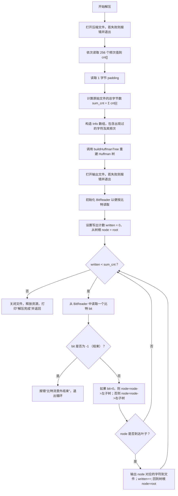
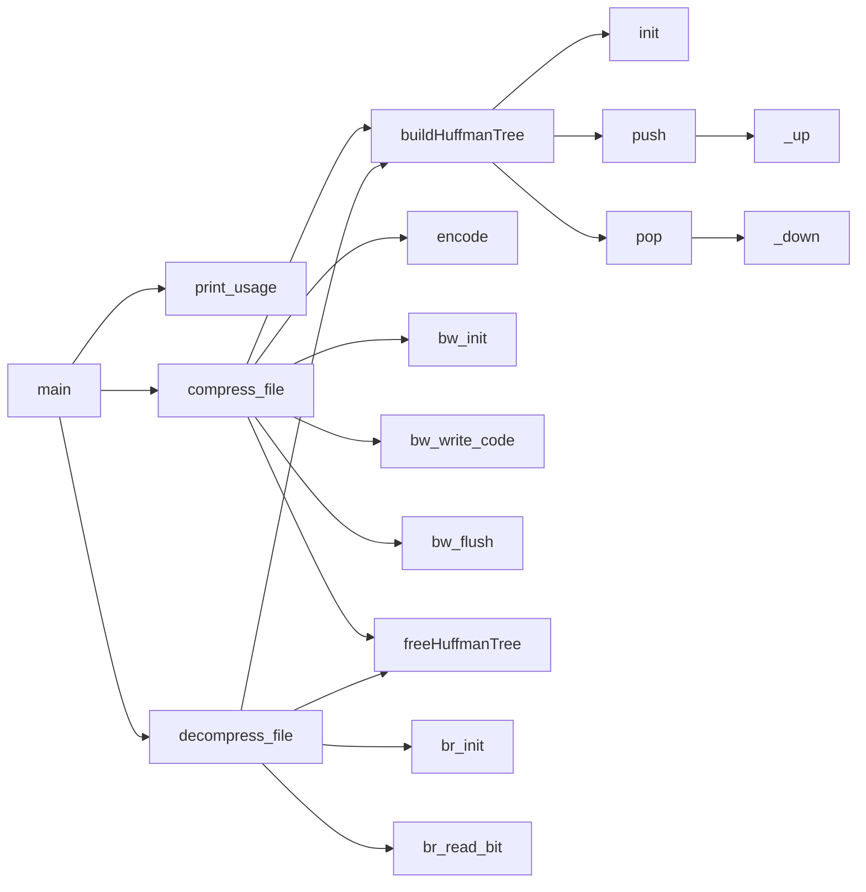

# 题目： Huffman编码

---

### 1. 需求分析 

**任务描述**： 
将任意一个指定的文件进行哈夫曼编码，并以真正的二进制位生成一个二进制文件（压缩文件）；反过来，可将一个压缩文件解码还原为原来的文件。

**输入/输出要求**：  

- **输入形式**：运行参数，待压缩/解压文件地址，压缩/解压文件地址。

- **输出形式**：压缩后的.huf文件。


**功能要求**： 

1. 对选定文件以二进制方式读入，一次读入1024字节。
2. 正确构建Huffman树并基于此进行压缩和解压。

---

### 2. 概要设计  

**解决思路**：  

1. 循环读入文件，统计字符频率。
2. 根据频率构建Huffman树。
3. 根据Huffman树得到编码表。

- 压缩时：

1. 将频率表写入文件头部。
2. 将编码后的字符按顺序写入文件。

- 解压时：

1. 根据频率表建立Huffman树。
2. 将Huffman树视作字典树，沿着字典树进行解码。

**数据结构**：  

结构体绑定字符和频率。

```c
typedef struct {
    unsigned char ch;
    ll cnt;
} Info;
```

二叉链表存储Huffman树。

```c
typedef struct BiTNode {
    Info data;
    struct BiTNode *lc, *rc;
} BiTNode, *BiTree;
```

二叉堆加速Huffman树的构建。

```c
typedef struct Heap {
    BiTree heap[MAXN];
    int size;  // 堆中元素个数，存储在 heap[1..size] 中
} *PriorityQueue;
```

**模块关系**：  

- **优先队列 / 小根堆**：`init`、`_up`、`_down`、`push`、`pop`，为每次合并取出最小频次节点提供支持。
- **Huffman 树构建**：`buildHuffmanTree`（创建所有叶子并两两合并）、`freeHuffmanTree`（释放整棵树）。
- **编码表生成**：`encode` 根据树从根到叶子记录路径 0/1 保存到 `table[ch]`。
- **按位写入**：`BitWriter` 的 `bw_init`、`bw_write_bit`、`bw_write_code`、`bw_flush`，把一串 `'0'/'1'` 字符写成真正的比特流。
- **按位读取**：`BitReader` 的 `br_init`、`br_read_bit`，把文件读字节后拆分成一个一个比特。
- **压缩主逻辑**：`compress_file`，从频次统计到树构造、编码表、写头、按位写正文。
- **解压主逻辑**：`decompress_file`，从读头到重建树、按位读正文并沿树还原字节。
- **程序入口**：`main` 负责解析命令行参数，决定调用“压缩”还是“解压”，并设置控制台编码。

---

### 3. 详细设计  

**关键算法**：  

1. **`void swap(BiTree *x, BiTree *y)`**

   - **作用**：交换两个 `BiTree` 指针（二叉树节点）的内容。
   - **细节**：在小根堆的上下调整过程中，用来交换堆数组里相邻元素的指针。

2. **小根堆（PriorityQueue）相关函数**
    这组函数共同构成了一个基于数组的最小堆，用来每次取出当前频率最小的 Huffman 节点。

   - **`void init(PriorityQueue pq)`**
     - **作用**：初始化一个空的优先队列（小根堆），把 `size` 设为 0。
   - **`void _up(PriorityQueue pq, int i)`**
     - **作用**：向上调整索引为 `i` 的堆元素。
     - **细节**：如果 `heap[i]` 的 `cnt` (频次) 比其父节点更小，就一直交换直到堆性质恢复。
   - **`void _down(PriorityQueue pq, int i)`**
     - **作用**：向下调整索引为 `i` 的堆元素。
     - **细节**：不断比较当前节点与它左右子节点的 `cnt`，把最小的浮到上面，直到 “父 ≤ 子” 满足小根堆条件。
   - **`void push(PriorityQueue pq, BiTree x)`**
     - **作用**：把一个新的 Huffman 子树 `x` 插入堆中。
     - **流程**：先把 `x` 放到堆尾 (`heap[++size] = x`)，再调用 `_up` 保持堆序。
   - **`BiTree pop(PriorityQueue pq)`**
     - **作用**：从堆顶弹出当前最小频次的子树节点。
     - **流程**：取出 `heap[1]`（最小），把堆尾元素移到 `heap[1]`，`size--`，然后调用 `_down` 恢复小根堆。返回原来的堆顶指针。

3. **`BiTree buildHuffmanTree(Info *arr, int n)`**

   - **作用**：根据传入的 `Info` 数组（包含 `ch` 和 `cnt`）构造一棵 Huffman 树，并返回树根指针。
   - **详细步骤**：
     1. 若 `n == 0` 返回 `NULL`。
     2. 用 `malloc` 分配一个 `PriorityQueue`，调用 `init` 初始化。
     3. 遍历 `arr[0..n-1]`，为每个 `Info` 新建一个 `BiTNode`（叶子），把 `data.ch = arr[i].ch`、`data.cnt = arr[i].cnt`，`lc=rc=NULL`，然后 `push` 入堆。
     4. 当堆中元素数 `>1` 时：
        - `pop` 出两棵最小频次子树 `min`、`subMin`；
        - 新建一个父节点 `parent`，令 `parent->data.cnt = min->cnt + subMin->cnt`、`parent->data.ch = 0`（无实际字符），`parent->lc = min`、`parent->rc = subMin`；
        - `push(pq, parent)`，把它放回堆。
     5. 最终 `pop(pq)` 就是 Huffman 树的根。释放堆本身的内存后返回根指针。

4. **`void freeHuffmanTree(BiTree root)`**

   - **作用**：递归释放整棵 Huffman 树所占用的内存。
   - **流程**：先递归释放左子树和右子树，再 `free(root)` 本节点。

5. **`void encode(BiTree root, char sign[], int p)`**

   - **作用**：根据已构造好的 Huffman 树 `root`，生成从根到每个叶子节点（每个字符）的比特串编码，并把它保存到全局 `table[ch]` 中。
   - **参数含义**：
     - `root`：当前子树的根节点。
     - `sign[]`：用来累积路径上写入的 `'0'` 或 `'1'`。
     - `p`：当前累积到 `sign[p-1]` 的长度。
   - **实现细节**：
     1. 如果 `root == NULL` 直接返回。
     2. 若当前节点同时 `lc == NULL && rc == NULL`，说明这是叶子：
        - 若 `p == 0`（仅有一个符号），则强制给它编码 `"0"`；
        - 否则把已经累积在 `sign` 中的比特串复制到 `table[root->data.ch]`。
     3. 如果有左子节点，就把 `sign[p] = '0'`、`sign[p+1] = '\0'`，递归 `encode(root->lc, sign, p+1)`；
     4. 如果有右子节点，就把 `sign[p] = '1'`、`sign[p+1] = '\0'`，递归 `encode(root->rc, sign, p+1)`。

6. **BitWriter 系列函数（按位写入）**
    用于把“字符对应的比特串”真正“打包到字节流”中。

   - **`void bw_init(BitWriter *bw, FILE *fp)`**
     - **作用**：初始化一个 `BitWriter`，把 `fp` 赋给 `bw->fp`，`buffer=0`，`bitcount=0`。
   - **`void bw_write_bit(BitWriter *bw, int bit)`**
     - **作用**：向 `BitWriter` 中写入一个比特（`0` 或 `1`）。
     - **流程**：
       1. `bw->buffer <<= 1;` 左移一位，把当前 buffer 的高位空出来；
       2. `if (bit) bw->buffer |= 1;` 如果要写入 `1`，就把最低位设为 1。
       3. `bw->bitcount++`；如果 `bitcount == 8`，说明 `buffer` 已填满 8 个比特，就 `fputc(buffer)` 写成一个字节到 `fp`，然后 `buffer=0; bitcount=0;`。
   - **`void bw_write_code(BitWriter *bw, const char *code)`**
     - **作用**：把一个以 `'0'`/`'1'` 组成的 ASCII 字符串 `code` （比如 `"01011"`）中的每个字符，依次调用 `bw_write_bit` 输出比特。
   - **`void bw_flush(BitWriter *bw)`**
     - **作用**：在写入完成后，把 `buffer` 中尚未凑满 8 位的那部分“左移补 0”并写出一个字节。
     - **细节**：如果 `bitcount > 0`，则 `buffer <<= (8 - bitcount)`，使低位补 0，把这个字节 `fputc` 输出，然后 `buffer=0，bitcount=0`。

7. **BitReader 系列函数（按位读取）**
    用于解压时把压缩文件的比特流拆分回一位一位，供 Huffman 树遍历使用。

   - **`void br_init(BitReader *br, FILE *fp)`**
     - **作用**：初始化一个 `BitReader`，把 `fp` 赋给 `br->fp`，`buffer = 0`，`bitcount = 0`。
   - **`int br_read_bit(BitReader *br)`**
     - **作用**：从 `BitReader` 中读取一个比特（返回 `0` 或 `1`），如果已到文件末尾且无更多数据，则返回 `-1`。
     - **流程**：
       1. 如果 `bitcount == 0`，说明当前 `buffer` 里没有可读的比特，就 `fgetc(fp)` 再读一个字节到 `buffer`，并把 `bitcount = 8`；
       2. 从 `buffer` 的最高位取出 1 位：`int bit = (buffer & 0x80) ? 1 : 0;`，再把 `buffer <<= 1; bitcount--;`；返回 `bit`。

8. **`void compress_file(const char *infile, const char *outfile)`**

   - **作用**：把原文件 `infile` 按照 Huffman 编码压缩，输出到 `outfile`。
   - **主要步骤**：
     1. **统计频次**：打开 `infile`，逐块读取到 `unsigned char buffer[1024]` 中，累加 `cnt[buffer[i]]++`。
     2. 把 `cnt[i] > 0` 的字节封装到 `Info signs[]` 中，计算出一共有 `tot` 种字符。
     3. **构建 Huffman 树**：调用 `buildHuffmanTree(signs, tot)` 获得 `HuffmanTree`。
     4. **生成编码表**：清空全局 `table`，再做一次 `encode(HuffmanTree, sign, 0)`，让 `table[ch]` 得到从根到该叶子的比特串（形如 `"01011"`）。
     5. **计算总比特数 & padding**：遍历 `i=0..255`，`if (cnt[i]>0) total_bits += cnt[i] * strlen(table[i])`；然后 `padding = (8 - (total_bits % 8)) % 8`。
     6. **写压缩头**：打开 `outfile`（`fopen(..., "wb")`），先 `for (i=0..255) fwrite(&cnt[i], sizeof(ll), 1, fout)`，再 `fwrite(&padding, 1, 1, fout)`。此时头部固定占用 `256×8 + 1 = 2049` 字节。
     7. **按位写正文**：用 `BitWriter bw; bw_init(&bw, fout);`，回到 `infile` 头，每次 `fgetc(fin)` 得到 `ch`，调用 `bw_write_code(&bw, table[ch])`，最后调用 `bw_flush(&bw)` 把末尾不满 8 位的剩余比特写出。
     8. 关闭文件，释放 `HuffmanTree`、`signs[]`，并在屏幕打印“压缩完成”的信息。

9. **`void decompress_file(const char *infile, const char *outfile)`**

   - **作用**：把压缩文件 `infile` 解压回原始内容，输出到 `outfile`。
   - **主要步骤**：
     1. **读取压缩头**：打开 `infile`（`"rb"`），先 `for (i=0..255) fread(&cnt[i], sizeof(ll), 1, fin)` 读回频率表；再 `fread(&padding, 1, 1, fin)` 读回 `padding`。
     2. **计算原始字节总数**：`sum_cnt = sum(cnt[i] for i=0..255)`。
     3. **重建 Huffman 树**：与压缩时一致，把 `cnt[i]>0` 的字节封装到 `signs[]` 中，调用 `buildHuffmanTree(signs, tot)` 得到 `HuffmanTree`；（可选）再用 `encode(...)` 重新生成 `table`，但真正解码时并不需要 `table`，只要用树本身遍历即可。
     4. **按位读正文并还原**：打开 `outfile`（`"wb"`），初始化 `BitReader br; br_init(&br, fin);`，令 `BiTree node = HuffmanTree; written = 0;`
        - 循环 `while (written < sum_cnt)`：
          - `bit = br_read_bit(&br)`，如果 `bit == -1` 报错结束；
          - `node = (bit == 0 ? node->lc : node->rc);`
          - 如果 `node` 是叶子（即 `node->lc==NULL && node->rc==NULL`），令 `fputc(node->data.ch, fout); written++; node = HuffmanTree;`
        - 循环直到写出 `sum_cnt` 个字节。
     5. 关闭文件，释放 `HuffmanTree`、`signs[]`，并打印 “解压完成” 信息。

10. **`void print_usage(const char *progname)`**

    - **作用**：当命令行参数不符合预期时，在标准错误上打印程序用法提示。

    - **内容**：

      ```
      用法：
        压缩：progname -c 原始文件路径 压缩后文件路径
        解压：progname -d 压缩文件路径 解压后文件路径
      ```

11. **`int main(int argc, char *argv[])`**

    - **作用**：程序入口，根据命令行参数决定“压缩”还是“解压”，或打印用法。
    - **主要流程**：
      1. 调用 `SetConsoleOutputCP(CP_UTF8); SetConsoleCP(CP_UTF8);`，使 Windows 控制台以 UTF-8 模式进行输入/输出，以保证中文提示正常显示。
      2. 检查 `argc != 4`，如果不等于 4，就调用 `print_usage(argv[0])` 并返回 `1`。
      3. 如果 `strcmp(argv[1], "-c") == 0`，就调用 `compress_file(argv[2], argv[3])`；
          如果 `strcmp(argv[1], "-d") == 0`，就调用 `decompress_file(argv[2], argv[3])`；否则再次打印用法并返回 `1`。
      4. 最后返回 `0`。

**流程图**：  

- 小根堆



-  构建 Huffman 树



- 编码



- 压缩




- 解压



**函数调用关系图**：



**调用关系说明**：

- **主程序 `main`**
  - 根据第一个参数是 `-c`（压缩）还是 `-d`（解压）来分支：
    - `-c` → 调用 `compress_file(infile, outfile)`
    - `-d` → 调用 `decompress_file(infile, outfile)`
- **压缩流程（`compress_file`）**
  - 先用 `fopen`/`fread` 统计频次到 `cnt[]`
  - 将非零频次封装为 `Info signs[]`，调用 `buildHuffmanTree` 构造 Huffman 树
  - 调用 `encode` 生成 `table[ch]`（按 `sign[]` 递归下去产生比特串）
  - 计算 `total_bits` 与 `padding`
  - 打开输出文件，写入 256×`cnt[i]` + 1×`padding`
  - 用 `BitWriter`（`bw_init`、`bw_write_code`、`bw_flush`）按位写真正的 Huffman 比特流
  - 释放树与中间数组
- **解压流程（`decompress_file`）**
  - 先用 `fopen`/`fread` 读回 256 个 `cnt[i]` + 1 个 `padding`
  - 计算 `sum_cnt = ∑ cnt[i]`
  - 将非零频次封装为 `Info signs[]`，调用 `buildHuffmanTree` 重建 Huffman 树
  - 打开输出文件，初始化 `BitReader`（`br_init`）
  - 循环 `br_read_bit`，沿树从根到叶子遍历，遇到叶子则 `fputc` 输出一个字节，直到写满 `sum_cnt` 个字节
  - 释放树与中间数组

---

### 4. 调试分析  

**问题与解决**：  

1. 对于C语言文件输入输出不太掌握，通过大模型了解了相关的语句和用法。
2. 对于二叉堆的实现不太了解，在OI-wiki上找到了相关资料。
3. 一开始没有考虑到字符信息，只统计了频次，发现这样在后续编码会很麻烦，设计了结构体将二者绑定。
4. 对于只有单个字符不断重复的文件，遍历Huffman树时会出现问题，通过特殊判断解决。

**改进方向**：  

- 判断文件类型，如果是已经压缩过的文件，不再进行压缩。
- 判断文件大小，如果文件很小，写入频次表占用的空间开销更大，则不进行压缩。

---

### 5. 用户使用说明  

**运行环境**：`GCC 13.2.0`

```posershell
用法：
  压缩：程序路径 -c 原始文件路径 压缩后文件路径
  解压：程序路径 -d 压缩文件路径 解压后文件路径
```

**输入示例**：  

```powershell
PS D:\wyk\Study\DataStructure> .\compress.exe -c .\kmp.c .\kmp.huf  
```

**输出示例**：  

```plaintext
压缩完成：".\kmp.c" → ".\kmp.huf"
原始字节总数 = 496，压缩后比特流总位数 = 2153，padding = 7
，压缩后字节总数 = 270
```

---

### 6. 测试结果  

---

### 测试1

输入1：

```plaintext
PS D:\wyk\Study\DataStructure> .\compress.exe -c .\kmp.c .\kmp.huf  
```

输出1：

```
压缩完成：".\kmp.c" → ".\kmp.huf"
原始字节总数 = 496，压缩后比特流总位数 = 2153，padding = 7
，压缩后字节总数 = 270
```

输入2：

```
PS D:\wyk\Study\DataStructure> .\compress.exe -d .\kmp.huf .\kmp.cpp
```

输出2：

```
解压完成：".\kmp.huf" → ".\kmp.cpp"
共还原原始字节数 = 496
```

#### 比较解压后的文件和原文件内容

**kmp.c**

```c
#include <stdio.h>
void get_nextval(char T[], int nextval[]) {
    int i = 1, j = 0;
    nextval[1] = 0;
    while (i < T[0]) {
        if (j == 0 || T[i] == T[j]) {
            ++i, ++j;
            if (T[i] != T[j]) nextval[i] = j;
            else nextval[i] = nextval[j];
        } else {
            j = nextval[j];
        }
    }
}
int main() {
    char t[7] = {7, 'a', 'a', 'a', 'a', 'b', '\0'};
    int nextval[10] = {0};
    get_nextval(t, nextval);
    return 0;
}

```

**kmp.cpp**

```cpp
#include <stdio.h>
void get_nextval(char T[], int nextval[]) {
    int i = 1, j = 0;
    nextval[1] = 0;
    while (i < T[0]) {
        if (j == 0 || T[i] == T[j]) {
            ++i, ++j;
            if (T[i] != T[j]) nextval[i] = j;
            else nextval[i] = nextval[j];
        } else {
            j = nextval[j];
        }
    }
}
int main() {
    char t[7] = {7, 'a', 'a', 'a', 'a', 'b', '\0'};
    int nextval[10] = {0};
    get_nextval(t, nextval);
    return 0;
}

```

内容完全一致。

#### 对比压缩后的文件大小


发现压缩后文件反而变大，这是由于kmp.c太小，写入频率表占用的空间反而更大。

### 测试2

生成1GB全0二进制文件

```powershell
PS D:\wyk\Study\DataStructure> fsutil file createnew .\big.bin 1073741824             
已创建文件 D:\wyk\Study\DataStructure\big.bin
```

压缩

```powershell
PS D:\wyk\Study\DataStructure> .\compress.exe -c .\big.bin .\big.huf
压缩完成：".\big.bin" → ".\big.huf"
原始字节总数 = 1073741824，压缩后比特流总位数 = 1073741824，padding = 0
，压缩后字节总数 = 134217728
```

解压

```powershell
PS D:\wyk\Study\DataStructure> .\compress.exe -d .\big.huf .\big2.bin
解压完成（单符号优化）：".\big.huf" → ".\big2.bin"，写入 1073741824 字节
```

对比`big.bin`与`big.huf`的大小：


1GB的文件被压缩到了128MB，可以看到，对于字符频率差异显著的文件，压缩率很高。